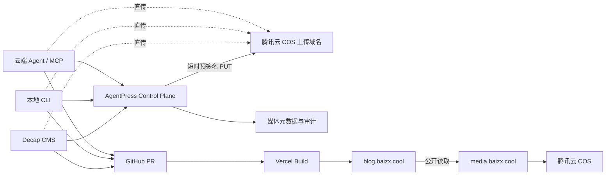

# AgentPress COS 媒体资产管线

本文定义 AgentPress 的生产媒体方案。目标是让 Decap CMS、云端 Agent、MCP 和本地 CLI 使用同一套上传能力，同时保证 COS 凭据不进入浏览器、Git 仓库、文章或 Agent 提示词。

## 1. 核心决策

- GitHub 保存代码、MDX、配置和可审计的媒体元数据；COS 保存图片、附件、音视频等二进制文件。
- 公开文章中的媒体允许匿名读取，但所有写入、替换和删除操作必须鉴权。
- 腾讯云服务器部署 `AgentPress Control Plane`，统一处理鉴权、对象键生成、预签名、上传确认、图片派生和审计。
- 所有写入端只调用 Control Plane，不直接保存 COS 永久密钥。
- 默认采用不可变、内容寻址的对象键；文章保存稳定的媒体 URL，不覆盖同名对象。
- 内容发布仍走 Git 分支和 Pull Request；媒体上传成功不等于文章已经发布。

## 2. 推荐拓扑



浏览器或 CLI 先向 Control Plane 申请一个只允许写入指定对象键、数分钟内有效的预签名 URL，再直接上传 COS。文件流不经过业务服务器，适合大文件，也不会把 COS 密钥暴露给客户端。

## 3. COS 资源规划

### 3.1 存储桶

第一阶段使用一个生产桶即可：

- 建议名称：`agentpress-media-<APPID>`
- 地域：优先与腾讯云服务器相同，降低服务器处理和回源延迟
- 访问权限：私有读写
- 公开出口：`https://media.baizx.cool`
- CDN：使用腾讯云 CDN 回源 COS，并为 CDN 服务开启回源鉴权
- HTTPS：给 `media.baizx.cool` 配置自动续期证书
- 版本控制：开启
- 生命周期：历史版本保留 30 天；未完成的分块上传 7 天后清理
- 日志与告警：开启请求日志、流量告警和费用告警

私有桶并不表示博客图片最终不可公开。它的作用是关闭 COS 源站匿名读取；读者通过公开媒体域名访问 CDN，由 CDN 使用授权回源。博客公开资源不启用带时效的阅读 URL，否则文章链接会过期，也不利于搜索引擎和其他 Agent 读取。

### 3.2 对象键

```text
assets/<sha256前2位>/<完整sha256>/original.<ext>
assets/<sha256前2位>/<完整sha256>/display.webp
assets/<sha256前2位>/<完整sha256>/thumb.webp
```

示例：

```text
assets/8f/8f3c...91a2/original.png
assets/8f/8f3c...91a2/display.webp
assets/8f/8f3c...91a2/thumb.webp
```

内容哈希带来去重、稳定 URL 和可验证性。上传同一文件时直接复用已有资产；修改图片会生成新 URL，避免 CDN 缓存与文章历史互相污染。

### 3.3 图片派生规则

- `original`：保留原始文件，仅供下载、重新处理或追溯。
- `display`：正文与封面使用，WebP，最长边默认不超过 2400 px。
- `thumb`：卡片和媒体选择器使用，WebP，最长边默认不超过 640 px。
- GIF、SVG、音视频和普通附件不强制转换；SVG 上传前必须进行安全检查。
- EXIF 中的定位和设备信息默认移除。

MDX 的 `cover` 和正文图片默认引用 `display.webp`；下载按钮才引用 `original`。

## 4. 统一上传协议

Control Plane 第一版提供以下接口：

### `POST /v1/assets/initiate`

请求：

```json
{
  "filename": "figure-1.png",
  "mimeType": "image/png",
  "size": 2714906,
  "sha256": "...",
  "purpose": "post-image"
}
```

响应：

```json
{
  "assetId": "ast_...",
  "objectKey": "assets/ab/.../original.png",
  "uploadUrl": "https://<bucket>.cos.<region>.myqcloud.com/...",
  "method": "PUT",
  "headers": { "Content-Type": "image/png" },
  "expiresAt": "..."
}
```

上传签名有效期建议 5 分钟，并绑定对象键、请求方法、内容类型和文件大小范围。预签名上传必须使用 COS 源站域名，不能使用 CDN 域名。

### `POST /v1/assets/{assetId}/complete`

服务端执行 `HEAD Object`，核验大小、MIME、哈希和 ETag，生成图片派生版本，然后返回可写入 MDX 的记录：

```json
{
  "id": "ast_...",
  "url": "https://media.baizx.cool/assets/.../display.webp",
  "thumbnailUrl": "https://media.baizx.cool/assets/.../thumb.webp",
  "originalUrl": "https://media.baizx.cool/assets/.../original.png",
  "mimeType": "image/webp",
  "width": 2345,
  "height": 670,
  "sha256": "..."
}
```

### 其他接口

- `GET /v1/assets?query=`：媒体选择器、CLI 和 Agent 搜索资产。
- `GET /v1/assets/{id}`：读取完整元数据和引用关系。
- `POST /v1/assets/{id}/archive`：软删除；第一版不提供直接物理删除。
- `POST /v1/assets/{id}/restore`：恢复软删除资产。

文件大小超过 5 GB 时改用基于临时密钥的分块上传；博客常规媒体优先使用预签名 PUT。

## 5. 各入口如何使用

### 5.1 云端 Agent 与 MCP

MCP Server 和 CLI 共享同一个 TypeScript 核心包，不重复实现上传逻辑。建议暴露：

- `media_upload(path, purpose, alt, license)`
- `media_search(query, type)`
- `media_get(asset_id)`
- `media_archive(asset_id)`
- `post_create(...)`
- `post_validate(slug)`
- `post_submit(slug)`

Agent 调用 `media_upload` 后获得 `assetId`、Markdown/MDX 片段和公开 URL，再写入文章。提交前执行内容校验、失效链接检查和资源引用检查，最后创建分支与 PR。Agent 不应直接调用 `git push main`。

云服务器内的 MCP 可以通过 Unix Socket 或内网调用 Control Plane。若需要从本地或 ChatGPT 远程访问，优先通过 Tailscale 或带 OAuth 的 HTTPS MCP 入口，不开放匿名写接口。

### 5.2 本地 CLI

推荐体验：

```bash
agentpress login
agentpress media upload ./figure.png --alt "实验结果"
agentpress post new paper
agentpress post validate my-paper
agentpress post submit my-paper
```

CLI 首次登录后把短期会话保存在系统凭据库；不在项目 `.env` 中保存 COS SecretKey。上传接口返回可直接粘贴的 MDX：

```mdx
<Figure
  src="https://media.baizx.cool/assets/.../display.webp"
  alt="实验结果"
  assetId="ast_..."
/>
```

### 5.3 Decap CMS

Decap 使用 GitHub backend 和 `editorial_workflow`，直接在 GitHub 创建草稿分支和 PR。它不需要、也不建议经由云服务器本地 Git 仓库再推送。

COS 通过自定义 Decap Media Library 接入：

1. 在 `/admin` 登录 GitHub。
2. 媒体选择器向 Control Plane 查询已有资产。
3. 新文件通过统一上传协议直传 COS。
4. Media Library 将公开 URL 返回给 image/file widget。
5. 保存文章时，仅 MDX 与媒体引用进入 PR，二进制文件不进入 Git。

Decap 官方内置的是仓库媒体目录以及 Uploadcare、Cloudinary 等集成；COS 需要自行注册 Media Library 适配器。第一阶段可暂时保留“从 URL 插入”，先用 CLI 上传 COS，等 Control Plane 稳定后再开发媒体选择器。

## 6. 身份与权限

### 云上凭据

- 不创建或使用主账号永久密钥。
- 优先让 Control Plane 通过腾讯云角色获取临时凭据。
- 若当前服务器环境不能绑定角色，则创建专用 CAM 子用户，只允许指定桶和 `assets/*` 前缀所需的 Put/Get/Head/Delete 操作。
- 永久密钥只存在服务器 Secret Store 或 root-only 环境文件中，用于签发短期权限；不进入 Git、Vercel、浏览器和 Agent 上下文。

### 调用方

- Decap：复用 GitHub OAuth 身份，只允许仓库所有者账户申请上传。
- 云端 Agent：独立 service token，权限可限定为上传、读取、创建 PR，不允许物理删除。
- 本地 CLI：OAuth/device login 或 Tailscale 身份；令牌可撤销。
- MCP：每个客户端独立 token，并记录 tool、资产、文章、commit 和时间。

## 7. CORS 与安全

若浏览器直传 COS，桶的 CORS 至少允许：

- Origins：`https://blog.baizx.cool`、未来的管理域名、开发环境的明确 Origin。
- Methods：`PUT`、`HEAD`、`GET`。
- Headers：上传签名实际需要的请求头；初期可以为 `*`。
- Expose Headers：`ETag`、`Content-Length`、`x-cos-request-id`。
- Max Age：600 秒。

不要把允许 Origin 写成 `*` 后再依赖 CORS 作为鉴权。真正的权限由 Control Plane 身份验证、短时签名和限定对象键共同保证。

还需执行 MIME 白名单、大小上限、图片解码验证、SVG 清洗、文件名规范化、速率限制和审计。博客 CSP 的 `img-src`、`media-src`、`connect-src` 需要加入媒体域名和上传接口域名。

## 8. Git 中保存什么

MDX 保存稳定 URL、alt、caption、license 和可选的 `assetId`。构建阶段扫描全部已发布文章，生成 `src/data/assets.json` 对应的公开 manifest；避免每次上传都修改一个大型共享 JSON，从而减少多个 Agent 同时写作时的 Git 冲突。

Control Plane 保存完整的上传审计和未发布资产状态。定期任务清理超过 30 天仍未被任何已发布内容引用的孤立资产，但先归档、后物理删除。

## 9. 实施顺序

1. 创建 COS 桶、媒体域名、HTTPS、回源鉴权、版本控制、生命周期和告警。
2. 创建最小权限 CAM 身份，并在服务器验证上传、读取和删除权限边界。
3. 在 AgentPress 仓库加入媒体配置、URL 校验和构建期 manifest。
4. 实现 Control Plane 的 initiate、complete、get 和 search。
5. 实现 `agentpress media upload`，先打通本地 CLI 到 COS。
6. MCP 复用同一核心包，实现媒体与文章工具。
7. 最后开发 Decap COS Media Library，并启用 GitHub editorial workflow。

完成第 1 步后，需要记录以下非敏感参数：Bucket 完整名称、Region、媒体域名和上传大小上限。SecretId、SecretKey、临时令牌不得写入设计文档或 Git。
