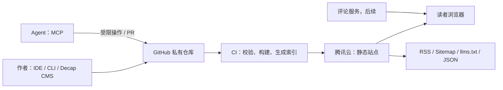

# AgentPress 设计文档（v0.1）

> 状态：待确认。本文确认前，只建立项目骨架，不实现正式页面、CMS、CLI 或 MCP 能力。

## 1. 定位与目标

AgentPress 是单一站长使用的个人知识中心：以内容质量和可检索性为中心，以 Git 私有仓库为唯一内容事实来源（source of truth），并让人和 Agent 都能以受控方式阅读、发布和维护内容。它不是多用户博客或社区，不包含注册、用户空间、关注关系和多作者权限体系。

核心目标：

1. 简洁、可信赖地呈现长短技术内容与个人表达。
2. 首期支持 Paper、Report、Note 和普通博客（包括每日简报）。
3. 内容以 MDX + Git 历史保存，编辑方式覆盖 IDE、CLI、Decap CMS 和 MCP Agent。
4. 静态优先、SEO 完整、腾讯云可自动构建部署，并保留评论等动态能力的扩展接口。

非目标（首期）：多用户社区、站内全文搜索服务、复杂社交动态、将 Agent 直接授权为无审核的生产发布者。

## 2. 用户与使用场景

| 用户 | 典型任务 | 首期入口 |
| --- | --- | --- |
| 站长（白卓新） | 写作、修改、发布、回滚 | Git / CLI / Decap CMS |
| 读者 | 阅读、按主题或时间查找、分享 | 主页、归档、文章页、分享卡片 |
| 技术招聘者/合作方 | 了解作者与公开内容 | 关于页、归档页 |
| Agent | 获取内容索引、阅读文章、起草或提交待审稿 | `llms.txt`、JSON API、MCP |

## 3. 信息架构

首期公开路由：

```text
/
├─ /archive/                 按年份、类型、标签浏览
├─ /about/                   个人资料、链接、联系与站点说明
├─ /posts/[slug]/            通用内容详情页
├─ /tags/[tag]/              标签聚合
├─ /feed.xml                 RSS
├─ /sitemap-index.xml        sitemap
├─ /llms.txt                 面向 Agent 的站点说明与内容索引入口
└─ /api/content/*.json       面向 Agent/集成的只读、版本化 JSON
```

文章以 `type` 区分而非拆分 URL，便于统一阅读体验和长期重分类。首页按“置顶 + 最新”组织，并提供类型和标签入口；首期不做复杂推荐算法。不同内容类型使用不同摘要卡片：Paper 使用论文卡片；Report 突出开源项目入口；Note 采用轻量、以正文摘要为主的时间卡片。

## 4. 内容模型

内容文件位于 `src/content/posts/<slug>.mdx`，资源在 `public/uploads/`（或后续迁移至对象存储）。每篇内容必须有：

```yaml
title: ""
description: ""              # SEO 和分享摘要
publishedAt: 2026-07-10
author: ""
type: paper                   # paper | technical-report | note | blog
tags: []
draft: true
featured: false
language: zh-CN
cover: "/uploads/..."        # 可选
canonicalUrl: ""              # 可选
repository: ""                # technical-report 可选/推荐
paperUrl: ""                  # paper 可选/推荐
series: ""                    # 可选
updatedAt: 2026-07-10         # 可选
```

Paper（`paper`）追加 `paperTitle`、`authors`、`affiliations`、`venue`、`publicationDate`、`doi` 和 `paperUrl` 字段；首页以论文卡片展示题目、作者、单位、会议/期刊、发表时间与论文链接。Report（`technical-report`）追加 `repository`、`demoUrl`、`projectStatus` 和 `highlights` 字段，在首页卡片展示开源仓库、演示链接和关键结论。Note（`note`）只保留通用字段，避免过多元信息干扰阅读。

普通博客（`blog`）以 `series: daily-brief | general` 区分每日简报和一般博客。

文章状态由 Git 分支/PR 与 `draft` 字段共同表达：`draft: true` 不出现在公开列表和 sitemap；合并到 `main` 后才进入生产构建。为避免链接失效，slug 发布后不改；需更名时配置永久重定向。

## 5. 技术架构



- **站点框架：** Astro（静态输出）+ TypeScript + MDX。
- **内容：** Astro Content Collections 负责 schema 校验与类型生成。
- **样式：** 首期建议原生 CSS + 设计令牌，避免为内容站引入重型 UI 运行时；若交互需求上升再引入轻量 islands。
- **资源：** 开发初期将图片和下载附件保存在本地 `public/uploads/`；生产阶段统一迁移至腾讯云 COS，站点只保存可审计的对象 URL。Astro 图片优化和社交卡片均在构建期完成。
- **代码：** Shiki 高亮、行号/复制、文件名标题；仓库分析只保存必要片段和链接，避免复制大段第三方代码。
- **搜索：** 首期使用构建期索引（Pagefind）提供无后端全文搜索；中文分词效果应在样稿阶段评估，必要时接入 Meilisearch/Algolia。

## 6. 视觉与交互原则

视觉关键词：克制、技术文档般清晰、信息密度可调。以蓝色为唯一强调色，并以高可读性和对比度为首要原则；默认浅色主题，并支持系统同步的深色主题。内容正文优先，卡片装饰最小化。

- 全站固定身份区：站点标题、Logo、简短介绍、导航与外链。
- 文章页强调元信息（类型、日期、预计阅读时间、标签、来源链接）和目录。
- 分享卡片以标题、类型、作者/站点、可选封面为核心，尺寸覆盖 Open Graph 1200×630。
- 无障碍基线：语义化结构、键盘导航、焦点状态、足够对比度、图片 alt 文本。
- 页脚固定预留“网站备案号”和“公安备案号”区域：未提供号码时不渲染；号码提供后分别链接至工信部备案系统和公安备案查询/展示页，并遵循其当前展示要求。

项目名称为 **AgentPress**；网站展示名称为 **今夜白的知识宫殿**。Logo 暂以空白占位，等待后续素材。临时个人资料取自 [home.baizx.cool](https://home.baizx.cool/)：白卓新（Zhuoxin Bai / 今夜白），重庆大学学生，研究关注 LLM 推理加速、KV Cache、Agent Memory、长上下文内存优化和高吞吐推理系统；外链暂保留 ORCID、GitHub、现有博客的占位。后续由你提供正式头像、简介、联系方式和链接。

## 7. SEO、可分享性与可观测性

- 每页生成唯一 `title`、description、canonical、Open Graph、Twitter Card 和 JSON-LD（Person、WebSite、BlogPosting/Article）。
- 自动输出 RSS、sitemap、robots.txt，并将草稿、私有内容和搜索页面排除在 sitemap 外。
- 文章更新日期与构建时间分别记录，避免误用构建时间作为内容发布时间。
- 接入可选的隐私友好统计（如 Umami/Cloudflare Web Analytics）；分析脚本需有开关并遵守适用隐私要求。
- 发布前 CI 校验 frontmatter、死链、图片引用、schema、构建和 Lighthouse 基线。

## 8. 发布与基础设施

推荐路径：GitHub 私有仓库的 `main` 触发 GitHub Actions，Actions 执行 `pnpm install --frozen-lockfile`、校验与 `astro build`，通过 SSH/rsync 将构建产物同步到腾讯云 CVM；服务器使用 1Panel 管理 Nginx、站点、HTTPS 证书与静态文件。后续资源 URL 切换至腾讯云 COS + CDN。

- 域名、HTTPS 证书、GitHub Deploy Key/腾讯云凭据全部存入 GitHub Actions Secrets，绝不写入仓库。
- `main` 是生产来源；`preview/*` 分支或 PR 可部署临时预览（首期可选）。
- 资源增长后，把 `public/uploads` 迁移到腾讯云 COS + CDN，内容仍保存可审计的引用。
- 每次发布保留构建产物版本或服务器端可回退目录；Git commit 是内容级回滚点。

### 构建位置对比

| 方案 | 优点 | 局限 | 结论 |
| --- | --- | --- | --- |
| GitHub Actions 构建，CVM 部署 | 构建环境可复现；PR 可先校验；不占用服务器 CPU/磁盘；部署凭据和构建日志集中 | 依赖 GitHub Actions 网络和 Secrets；首次配置稍多 | **首选** |
| CVM 上构建 | 配置直观；不需要将服务器 SSH 部署密钥交给 GitHub | 服务器需维护 Node/pnpm/依赖缓存；构建会影响线上机器；环境漂移、回滚和审计较弱 | 仅适合早期手动发布或 Actions 不可用时的备选 |

因此采用“Actions 构建 + CVM（1Panel 管理的 Nginx）仅提供静态服务”。CVM 不保存 GitHub 工作副本或生产构建依赖，只接收经 CI 验证的 `dist/` 文件；这也使后续迁移 COS/CDN 更简单。

## 9. Decap CMS（后续实现）

CMS 入口为 `/admin/`，通过 GitHub backend 直接向私有仓库提交。私有仓库不能把 OAuth client secret 放在静态站内，因此需要独立的 OAuth 授权网关（部署在腾讯云、Serverless 或可信托管服务），并仅在该网关保存密钥。

CMS 将按内容类型提供表单、草稿开关、媒体上传和预览。CMS 提交一律进入 `content/draft-*` 分支并创建 PR，禁止直接推送 `main`；生产发布只发生在经审核合并后。

## 10. CLI 与 MCP（后续实现）

采用一个共享领域层（解析、schema、slug、校验、Git 操作），由 CLI 与 MCP 共同调用，避免两套发布逻辑。

CLI 初步命令：

```text
agentpress init
agentpress post new
agentpress post validate [slug]
agentpress post list
agentpress publish --branch <name>
```

MCP 初步工具遵循最小权限原则：

| 工具 | 权限 | 行为 |
| --- | --- | --- |
| `list_content` / `get_content` | 只读（需授权） | 检索公开或仓库内授权内容 |
| `create_draft` / `update_draft` | 写草稿 | 创建或修改草稿文件，强制 schema 校验 |
| `validate_content` | 只读 | 输出 lint、链接、frontmatter 问题 |
| `request_publish` | 创建 PR | 提交分支并请求发布，不直接生产发布 |

MCP 服务以本地 stdio 为第一实现目标，仅供你的 Agent 使用，使用显式仓库路径与 GitHub token/SSH 凭据；远程 MCP 仅在认证、审计日志、权限隔离设计完成后开放。所有写操作都应留下 Git commit/PR 审计轨迹，并禁止读取 `.env`、Actions secrets 或站外任意路径。

## 11. 评论系统（后续实现）

评论采用 Giscus（GitHub Discussions）：无需自建数据库、与开发者读者画像契合、可按文章路径映射讨论。前提是评论仓库/Discussion 对读者可见；若博客内容或互动需要完全独立，可改为 Cusdis 或自托管方案。

评论在功能开关下以客户端 island 加载，不阻塞正文渲染或 SEO。需确认是否接受读者使用 GitHub 登录；若不接受，选择匿名/邮箱型评论服务并增加反垃圾策略。

## 12. 安全与内容边界

- 私有仓库并不等于公开站点内容自动安全：构建前必须仅导出 `draft: false` 且明确位于公开 collection 的文件。
- 不发布密钥、内部 URL、未授权论文/代码、个人敏感信息；CI 增加 secret 扫描。
- 互联网的其他 Agent 可匿名读取已发布内容的元数据、HTML 和原始 MDX；公开接口只读、按版本稳定输出，添加速率限制与 `noindex` 边界。任何管理性 API、MCP 工具、草稿和仓库内容均必须经你的身份授权。

## 13. 交付分期与验收

| 阶段 | 范围 | 验收结果 |
| --- | --- | --- |
| 0（当前） | 设计确认、Astro+MDX 骨架 | 文档确认；`pnpm build` 通过 |
| 1 | 视觉基础、首页/归档/关于、三种内容 schema、样稿、SEO/RSS/sitemap、备案页脚 | 能发布并良好阅读一组 MDX 内容 |
| 2 | 分享卡片、搜索、部署 CI/CD | 可在腾讯云稳定自动发布 |
| 3 | Decap CMS OAuth、CLI、只读 Agent 接口 | 人和本地 Agent 可安全管理草稿 |
| 4 | MCP 写草稿/PR 流、评论 | 受控 Agent 发布工作流与互动能力 |

## 14. 本轮待确认事项

1. 站点暂定名称是否为 **AgentPress**？请确认 Logo 形式；个人资料目前采用主页临时占位。
2. 请在后续提供域名、工信部备案号及公安备案号；部署采用 CVM + 1Panel + Nginx，资源生产阶段进入 COS。
3. CMS 和你的 Agent 写入一律走“草稿分支 + PR 审核”（已确认）。
4. 评论采用 Giscus，并接受 GitHub 登录（已确认）。

确认后，我将以阶段 1 开始：建立内容 schema 与设计系统，完成首页、归档、关于及文章阅读页，并用样稿验证整个内容流。
